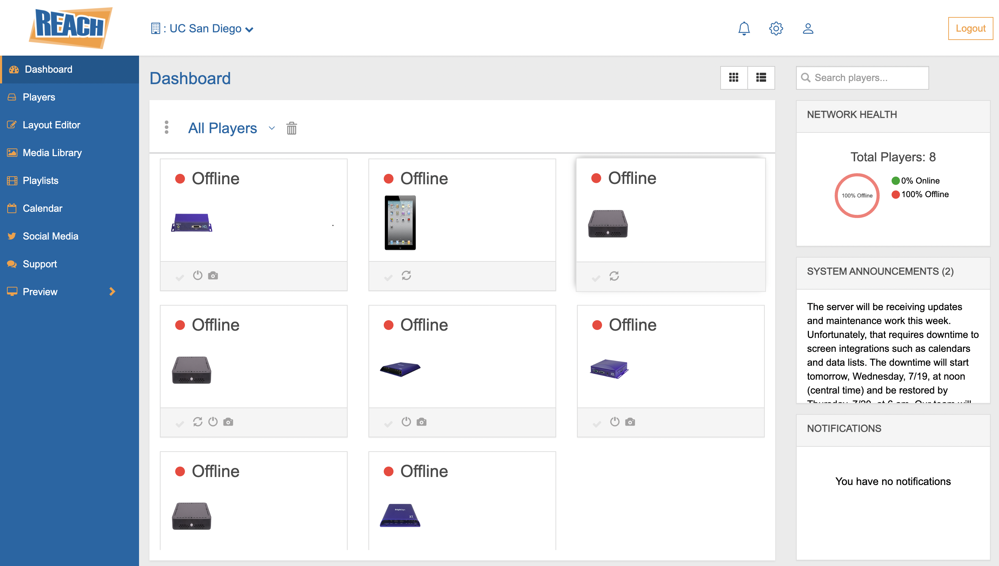
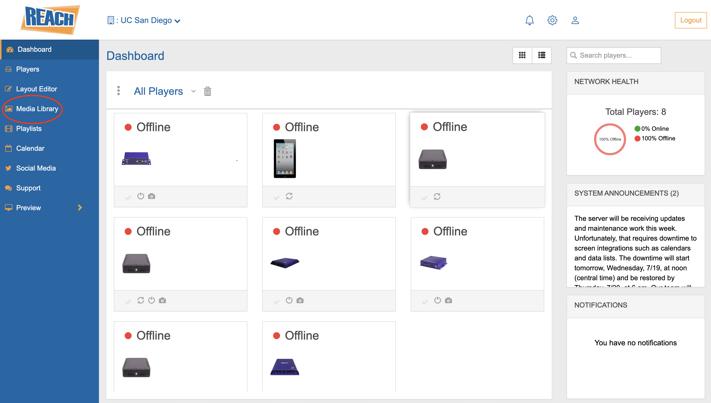
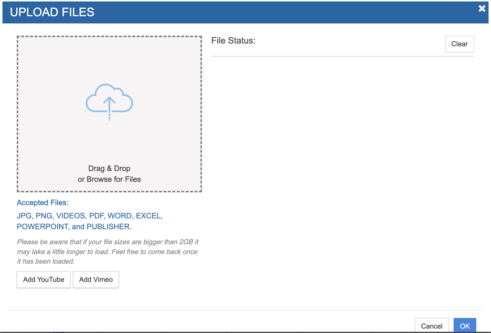
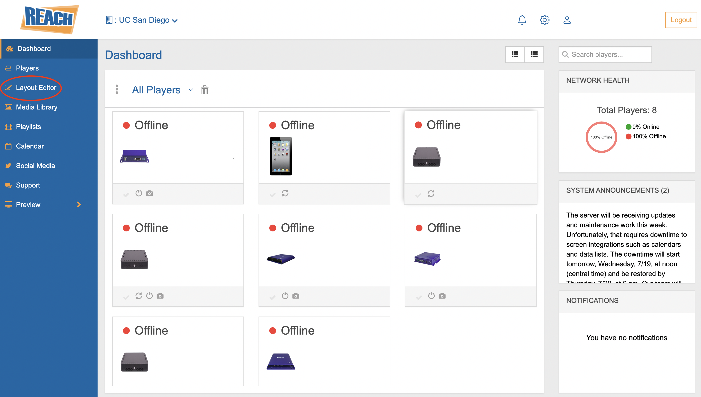

# Navigating Reach

Before diving into uploading content, log into your [REACH](https://build.reachcm.com/spark/6.16.0.0/) account. Once logged in, you should be at your dashboard, which shows the players that are connected to the account. 

Check that the corresponding player is online and functioning properly. If not, then fix that issue before going any further.

## Uploading Content
In order to upload content, you will need to upload any files (images,videos,pdfs,etc) to the media library. Navigate to the left of the screen, and click on "Media Library".

Once you are redircted to the media library, click on "Add Assets" and then "Upload Files".

You will see a popup window, in which you are allowed to drag any files or browse for the files on your local computer. If you want to add a youtube or vimeo video, click on the corresponding button and copy and paste the link.

## Creating and Editing Playlists

## Creating and Editing Layouts
Now that you have created a playlist, you need to create layout that will play it at whatever lapses of time the user wants. Now navigate to the left of the screen and click on "Layout Editor."

Then click on the blue button "Create Layout". You should see a window pop up that allows you to name the layout and assign it a size. You can either pick a size that is listed already or use a custom size by entering a width and height.

